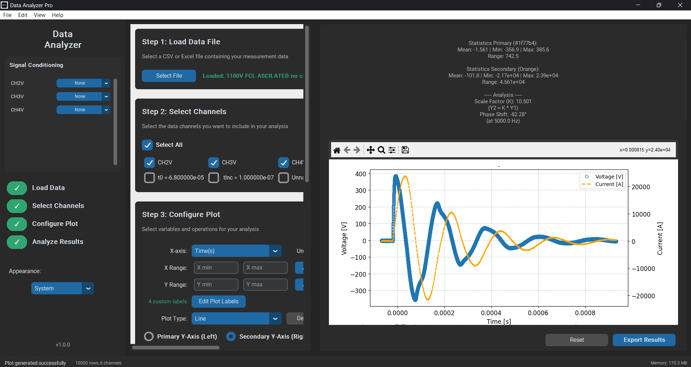

# 📈 Data Analyzer Pro

**An advanced, user-friendly GUI tool for experimental physics and engineering data analysis.**



---

## 💡 Motivation & Purpose
**Why was this tool built?**

For students in Exact Sciences and Engineering, analyzing large datasets from lab experiments (oscilloscopes, data loggers) can be a tedious and repetitive task. We often find ourselves writing the same Python scripts over and over just to perform basic signal processing or curve fitting.

**Data Analyzer Pro** was designed to solve this pain point. It bridges the gap between raw data and scientific insight. It allows researchers and students to load massive datasets and perform complex mathematical operations, filtering, and fitting instantly—without writing a single line of code.

It transforms the "chore" of data analysis into a streamlined, visual process.

---

## ⚡ Key Features

### 1. 📂 Universal Data Import
* **Formats:** Supports `.csv`, `.xlsx` (Excel), and `.txt` files.
* **Smart Loading:** Auto-detects encoding (UTF-8, UTF-16, etc.) and delimiters to handle messy data exports from various instruments.

### 2. 🧮 Powerful Mathematical Engine
Perform operations on your data channels in real-time.
* **Basic Arithmetic:** Addition, Subtraction, Multiplication, Division (`A + B`, `A / B`, etc.).
* **Calculus:**
    * Numerical Differentiation (`dA/dt`) - ideal for finding rates of change.
    * Numerical Integration (`∫A dt`) - ideal for calculating accumulated quantities.
* **Custom Formulas:** A powerful expression evaluator allowing complex logic like `sin(A) * exp(-B)`.
    * *Note on variables:* You can refer to columns by their names. If you mapped a column to channel 'A' in the GUI, simply use `A` in the formula. Otherwise, use the exact column name as it appears in your file.

### 3. 📉 Advanced Signal Processing
Clean your signal and analyze frequency components with professional-grade tools:
* **FFT Analysis:** Real-time Fast Fourier Transform with customizable windows (Hanning, Hamming, Blackman), Zero-padding, and Peak Detection.
* **Digital Filters:**
    * Low-Pass, High-Pass, Band-Pass, Band-Stop.
    * Choice between **Butterworth** (smooth response) and **Chebyshev** (steep rolloff) designs.
* **Smoothing:** Moving average filters to reduce high-frequency noise.
* **DC Correction:** Auto-baseline subtraction.

### 4. 📊 Professional Visualization (Dual Axis)
* **Dual Y-Axis:** Plot two different physical quantities (e.g., Voltage and Current) on the same time axis with independent scaling.
* **Customization:** Full control over line colors, markers, line styles, and axis labels.
* **Interactivity:** Zoom, Pan, and save plots directly from the interface.

### 5. 📏 Curve Fitting
* **Auto-Fit:** Automatically attempts to fit common physical models (Linear, Exponential, Sine, Damped Sine) and selects the best $R^2$.
* **Manual Fit:** Define your own fit function (e.g., `p0 * exp(-x/p1)`) and provide initial guesses.

### 6. 💾 Export & Reporting
* **Data Export:** Save your *processed* data (after filtering and math operations) to a new CSV file.
* **Alignment:** Automatically aligns different channels to a master time axis using interpolation.
* **Plot Export:** Save high-resolution images for lab reports and papers.

---

## 🛠️ Installation & Usage

### Prerequisites
* Python 3.12 or higher.
* Recommended: A virtual environment.

### Steps
1. **Clone the repository:**
   ```bash
   git clone https://github.com/Yehonatan-96/Data-Analyzer-Pro.git
   cd Data-Analyzer-Pro
   ```
2.  **Install dependencies:**
    ```bash
    pip install -r requirements.txt
    ```

3.  **Run the application:**
    ```bash
    python main.py
    ```

---

## 🧠 Credits & Acknowledgment

This project is a collaboration between human ingenuity and artificial intelligence.

* **Concept, Architecture & Physics Logic:** **Yehonatan Smaja**
    * *M.Sc. Student in Applied Physics, Bar-Ilan University.*
    * Designed the tool to meet the rigorous demands of experimental research.
* **Implementation & Coding:** **AI Assistants**
    * *"My brain, their typing"* – The core logic, feature requirements, and mathematical validation were directed by the author, while AI tools accelerated the coding and syntax implementation.

---

## ⚖️ License

**Non-Commercial Use Only**

This software is provided free of charge for **personal, educational, and academic research purposes only**.

* ✅ Students and Researchers may use this tool freely for their work.
* ❌ **Commercial use is strictly prohibited.**
* ❌ Usage by for-profit companies or integration into commercial products requires explicit written permission from the author.

---
*Developed with ❤️ for the Physics & Engineering community.*
